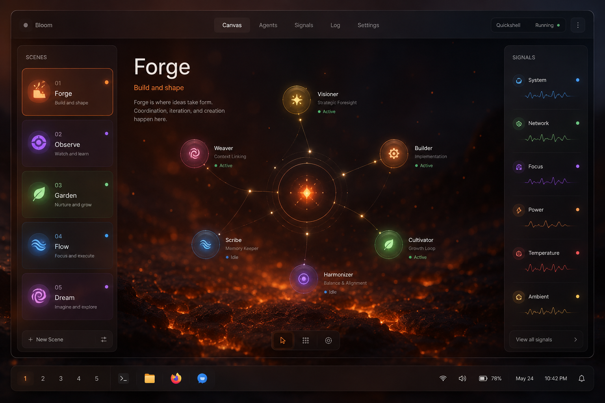
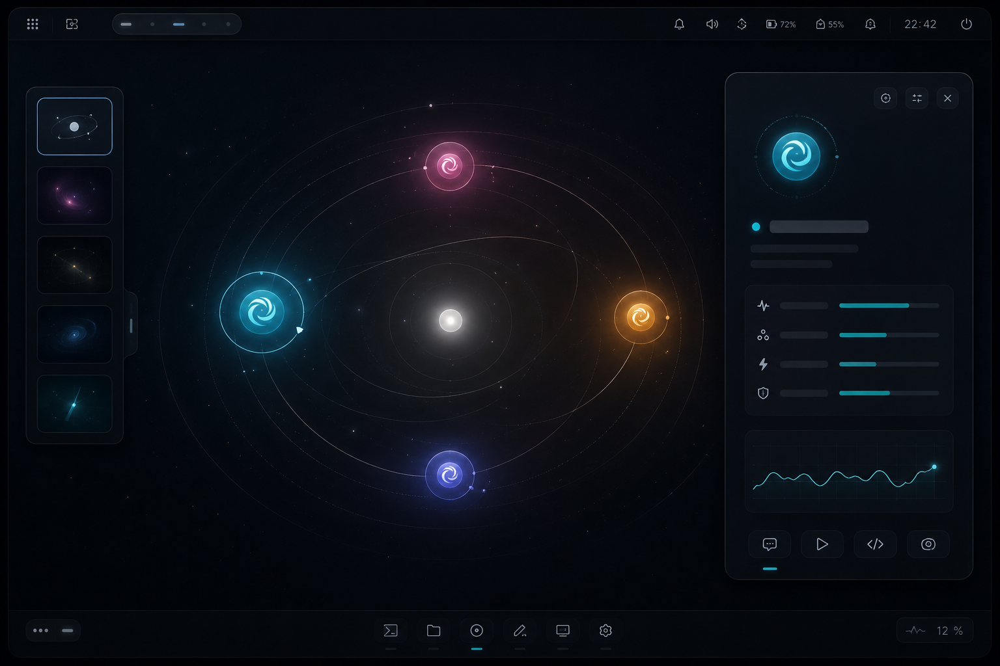
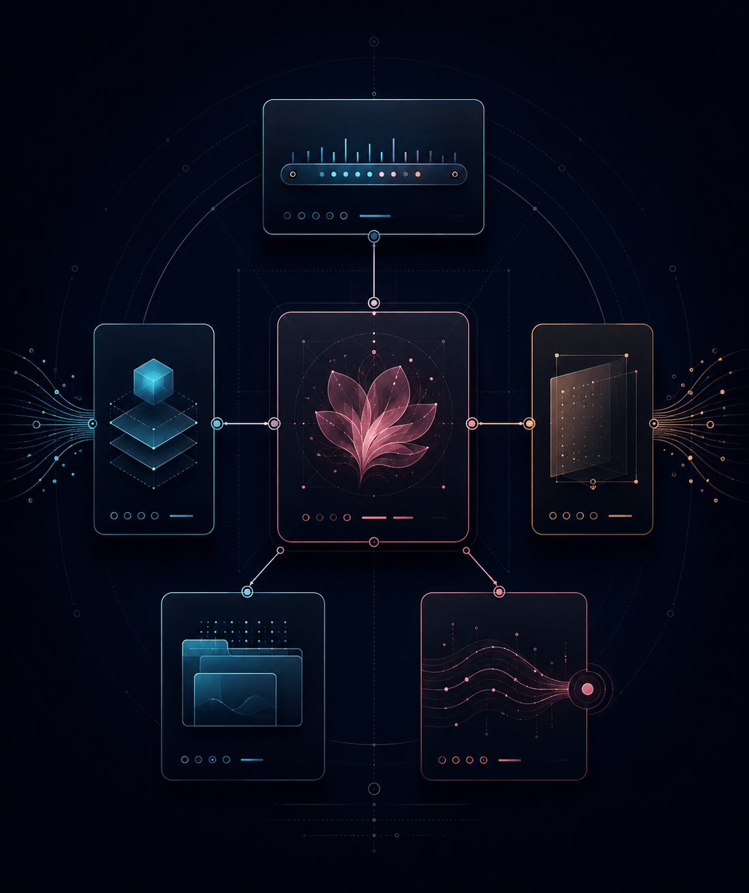

# Bloom for Omarchy

Bloom is a cinematic living-workspace plugin for Omarchy Quattro. It gives
your desktop five intentional rooms — Forge, Hush, Library, Afterglow, and
Orbit — then makes your local AI sessions visible as a calm, navigable Agent
Constellation. Bloom also restores your working desktop after reboot: it saves
which applications were open, which workspaces and monitors they belonged to,
window placement and state, the active workspace, plus each workspace's scene,
wallpaper, and atmosphere.

The point is not another dashboard. The point is a desktop that changes its
posture with you — and comes back in that posture when you log in again.

## The experience

Bloom adds one small glyph to the Omarchy bar. Click it to open a full-screen
canvas, then move through three views:

- Scenes: switch the emotional posture of the workspace and see the wallpaper
  that currently shapes the room.
- Constellation: see local agent sessions as a living orbit, with attention
  states brought forward instead of hidden in another terminal.
- Wallpapers: browse Bloom's bundled scene art plus your own local collection.

The five built-in scenes are deliberately distinct:

| Scene | Posture | Accent |
| --- | --- | --- |
| Forge | ship, debug, decide | Ember orange |
| Hush | concentrate, write, think | Pale teal |
| Library | research, connect, collect | Paper gold |
| Afterglow | review, reflect, close | Rose |
| Orbit | coordinate, scan, overview | Periwinkle |

## Why the constellation matters

Bloom watches for local agent processes and accepts richer status events from a
small JSONL bridge. Each session can report its provider, project, branch,
status, summary, progress, and whether it needs attention.

The interface is intentionally useful even before integrations are perfect:

- process discovery provides a safe fallback for Codex, Claude, Gemini,
  OpenCode, Copilot, Pi, and Crush sessions;
- event records enrich the same node without requiring a network service;
- attention nodes move to the front of the list and tint the bar glyph;
- a node with a live PID can focus its window through Hyprland;
- demo mode makes the full composition easy to review without running agents.
- each focused workspace keeps its own scene and wallpaper assignment;
  workspaces 1–5 begin as Forge, Hush, Library, Afterglow, and Orbit.

## Architecture

The plugin is a native Omarchy Quattro plugin with one shared headless service,
one overlay canvas, and one bar widget:

1. The Bloom glyph calls the Omarchy shell router with a view payload.
2. The service owns scenes, persisted selection, wallpaper indexing, agent
   polling, the local JSONL event stream, and desktop-session persistence.
3. The overlay receives the same service instance and paints the scene canvas,
   wallpaper layer, constellation, keyboard handling, and focus action.
4. Bundled wallpapers ship inside the plugin. User wallpapers are read from
   XDG_CONFIG_HOME/omarchy-bloom/wallpapers/, with optional scene folders.
5. Desktop restore uses Hyprland IPC and conservative application launch
   identities; it does not replay arbitrary process command lines or environment
   variables.
6. No agent data leaves the machine. The plugin has no network client and no
   install hook.

The architecture artwork above is a visual overview; the exact runtime
contract is encoded in manifest.json and the QML entry points.

## Install

Bloom targets the Omarchy Quattro plugin API.

~~~bash
omarchy plugin add https://github.com/benclawbot/Bloom_Omarchy.git --enable
~~~

If Bloom is already installed, update it in place. `--yes` avoids Omarchy's
interactive diff confirmation and the updater rescans plugins automatically:

~~~bash
omarchy plugin update org.bloom.omarchy --yes
~~~

`--enable` enables the plugin and Bloom starts shaping workspaces immediately.
The manifest declares the right bar section, where Bloom appears as a ✦ glyph.
Click the glyph to open the canvas; the single activation toggle
lives in the right-hand Signal panel. No terminal command is part of normal use. On
a genuinely fresh install, Bloom prepares workspace 1–5 silently in the
background. Click the glyph whenever you want to open Bloom. If you are
scripting a non-interactive install, append --yes to accept Omarchy's plugin
safety prompt.

The first canvas shows an activation card: Bloom is already active in the
shell, workspaces 1–5 have their initial atmospheres, and closing the canvas
does not undo the workspace change. Select ENTER BLOOM to move into the normal
control surface.

If the shell was already running and the glyph is not visible, refresh the
plugin registry and place it explicitly:

~~~bash
omarchy-shell shell rescanPlugins
omarchy bar put org.bloom.omarchy --section right
~~~

Plugins run inside omarchy-shell as unsandboxed QML, so review the source
before installing any third-party plugin. Bloom itself only uses local
process/file APIs described below.

## How Bloom launches

Enabling the plugin loads Bloom's lightweight service with omarchy-shell and
turns workspace atmospheres on by default. The full canvas stays out of the
way until you click the Bloom bar glyph. The
right-hand Signal panel contains the single Bloom Active toggle.

For troubleshooting only, the equivalent direct shell command is:

~~~bash
omarchy-shell shell summon org.bloom.omarchy '{"view":"scenes"}'
~~~

Bloom stays loaded and active in the background after login. It never opens a
modal by itself; click the bar glyph when you want the canvas. The preference
is stored in `XDG_CONFIG_HOME/omarchy-bloom/config.json`; Bloom does not create
a second startup process or modify your compositor configuration.

Bloom also scopes atmosphere to the focused Hyprland workspace. Selecting a
scene or wallpaper while you are on workspace 2 changes workspace 2's
assignment; switching to workspace 1–5 restores that workspace's saved
assignment. The desktop wallpaper is committed through Omarchy's own
background setter, so it remains after Bloom closes.

## Desktop session restore

Bloom's **SAVE / FRESH** control governs reboot/session restoration separately
from the **Bloom Active** atmosphere toggle.

With **SAVE** enabled, Bloom continuously snapshots the current Hyprland desktop
for the next boot. The snapshot records normal application windows, workspace
number, monitor identity, window order, tiled/floating state, floating geometry,
pinned/fullscreen state, the active workspace, and a conservative application
launch identity. Closing an application removes it from later snapshots; opening
one adds it after the desktop settles.

On the next login Bloom waits for Hyprland IPC, restores the saved active
workspace first, then reconstructs the remaining workspaces in the background.
Applications for those later workspaces are launched with Hyprland's silent
workspace rule so they are created directly on their saved workspace instead of
briefly appearing on the workspace you are using. Bloom still verifies every
new window and applies `movetoworkspacesilent` as a fallback for applications
that fork, reuse an existing process, or otherwise ignore the initial placement.
Focus is returned to the saved active workspace throughout the restore.

With **FRESH** enabled, Bloom skips application/window restoration on the next
boot and leaves the previous saved snapshot untouched. Switching back to SAVE
during that boot starts saving the desktop you are using now; it does not
suddenly reopen the older session.

Bloom deliberately does **not** persist `/proc/.../cmdline`, arbitrary shell
commands, environment variables, or application arguments. This avoids turning
the session file into a replay log containing secrets or one-shot commands.
Instead it prefers a validated `.desktop` application identity and falls back
to a safe absolute executable when available.

Desktop placement and application-private state are different layers. Bloom
restores applications and windows, but the application itself currently owns
things such as browser tabs, VS Code projects/editor tabs, unsaved buffers,
terminal working directories and running shells, tmux/zellij sessions, and
other private in-app state. Applications that already provide their own session
restore may therefore come back with more context automatically; Bloom does not
yet serialize that private state itself.

The saved desktop snapshot lives at:

~~~text
$XDG_STATE_HOME/omarchy-bloom/desktop-session.json
~~~

which is normally `~/.local/state/omarchy-bloom/desktop-session.json`. See
[`docs/SESSION_RESTORE.md`](docs/SESSION_RESTORE.md) for the implementation-level
restore contract and current limitations.

## Controls

| Key / action | Result |
| --- | --- |
| Click Bloom glyph | Open or close the Bloom canvas |
| Bloom Active toggle | Pause or resume workspace atmospheres; does not disable desktop SAVE |
| SAVE / FRESH | Save and restore the desktop across reboot, or skip restore on the next boot |
| 1 … 5 | Jump to Forge, Hush, Library, Afterglow, or Orbit |
| Left / Right | Previous or next scene |
| N | Next wallpaper |
| A | Agent Constellation view |
| W | Wallpaper view |
| S | Scenes view |
| Tab | Cycle views |
| Up / Down | Select an agent |
| Enter | Focus the selected live agent window |
| Esc | Close Bloom |
| Right-click glyph | Next wallpaper |
| Middle-click glyph | Next scene |
| Demo pill | Populate a reviewable constellation |

## Wallpapers

Bloom ships ten original, scene-matched wallpapers:

~~~text
assets/wallpapers/default/<scene>/*.webp
~~~

Use **Add your own** in Bloom's wallpaper view to choose an image. Bloom copies
it into the current scene's personal folder and selects it immediately. You can
also add files manually without touching the repository:

~~~text
XDG_CONFIG_HOME/omarchy-bloom/wallpapers/
XDG_CONFIG_HOME/omarchy-bloom/wallpapers/forge/
XDG_CONFIG_HOME/omarchy-bloom/wallpapers/orbit/
~~~

Bloom accepts png, jpg, jpeg, webp, and avif. A wallpaper inside a
scene folder is preferred for that scene; a wallpaper at the root is treated
as a neutral fallback.

## Agent events

For integrations that know more than a process name, append one JSON object
per line to the runtime event stream. The repository includes a tiny helper:

~~~bash
~/.config/omarchy/plugins/org.bloom.omarchy/scripts/bloom-agent-event \
  '{"id":"codex-bloom","provider":"codex","project":"bloom","branch":"main","status":"working","summary":"Polishing the focus rail","progress":0.72}'
~~~

Supported status values are working, waiting, attention, paused, and offline.
The complete payload contract lives in schemas/agent-event.schema.json.

## CLI helpers

The optional scripts/bloomctl wrapper maps friendly commands to Omarchy shell
IPC:

~~~bash
bash ~/.config/omarchy/plugins/org.bloom.omarchy/scripts/bloomctl open
bash ~/.config/omarchy/plugins/org.bloom.omarchy/scripts/bloomctl constellation
bash ~/.config/omarchy/plugins/org.bloom.omarchy/scripts/bloomctl scene forge
bash ~/.config/omarchy/plugins/org.bloom.omarchy/scripts/bloomctl next-scene
bash ~/.config/omarchy/plugins/org.bloom.omarchy/scripts/bloomctl next-wallpaper
bash ~/.config/omarchy/plugins/org.bloom.omarchy/scripts/bloomctl active off
bash ~/.config/omarchy/plugins/org.bloom.omarchy/scripts/bloomctl active status
~~~

Copy or symlink it into a directory on your PATH if you want the shorter
`bloomctl` command for keybindings or menu actions. Use `bloomctl active off`
to pause Bloom's workspace atmospheres. The Signal rail provides the same
active-state toggle. This does not change SAVE/FRESH desktop-session behavior.

## Omarchy menu extension

docs/omarchy-menu-extension.jsonc contains three optional menu entries for
Bloom. Copy its entries into your local
XDG_CONFIG_HOME/omarchy/extensions/omarchy-menu.jsonc and reload the shell.

## Repository map

~~~text
manifest.json                 Quattro plugin contract
BarWidget.qml                 Small Bloom glyph in the bar
Overlay.qml                   Full-screen living-workspace canvas
Service.qml                   Shared state, persistence, discovery, IPC
components/                   Scene cards, agent nodes, constellation canvas
models/                       Pure scene, agent, and wallpaper logic
assets/wallpapers/default/    Bundled GPT Image 2.0 scene wallpapers
scenes/                       Human-readable scene metadata
schemas/                      Agent event schema
scripts/bloom-session         Desktop-session restore entry point
scripts/bloom-session-core    Session snapshot, matching, placement, and restore logic
scripts/                      Other CLI and event bridge helpers
docs/SESSION_RESTORE.md       Desktop-session restore contract and limitations
docs/OMARCHY_BLOOM_SPEC.md    Full product and technical specification
test/validate.py              Runtime-independent validation
.github/workflows/ci.yml      PR and main-branch validation
~~~

## Development

The fastest local loop on an Omarchy machine is:

~~~bash
git clone https://github.com/benclawbot/Bloom_Omarchy.git
cd Bloom_Omarchy
python3 test/validate.py
python3 test/unit/session_restore_test.py
node --test test/unit/models.test.js
omarchy plugin add "$PWD" --enable --yes
omarchy-shell shell rescanPlugins
~~~

The same repository validator and unit tests run automatically in GitHub Actions
for every pull request and every push to `main`. Compositor-level placement still
needs an actual Hyprland/Omarchy session because CI does not provide the running
desktop IPC surface.

## Launch video

A live launch video is intentionally not included yet. This build environment
has no running Omarchy/Wayland session or computer-use surface, so producing a
video here would not be a truthful screen recording. Record the real canvas
after installing on Omarchy and place the capture here when available:

~~~text
docs/assets/bloom-launch.mp4
~~~

## Visual provenance

The hero, wallpapers, product previews, and architecture artwork in this
repository were generated with GPT Image 2.0 for Bloom's visual direction.
They contain no external brand marks and are not used as runtime UI
dependencies.

## License

MIT. See LICENSE.
